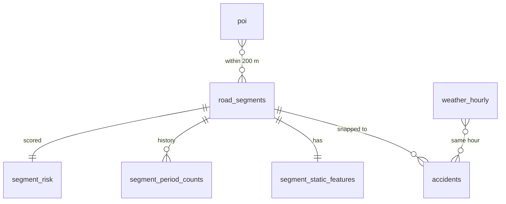

# Road Accident Black-Spot Predictor (PostGIS + ML)

Ranks road segments in a city by their predicted risk of a **serious or fatal accident next quarter**,
explains each ranking with SHAP, and shows the result on an interactive map with rule-based intervention hints.

**Stack:** PostgreSQL + PostGIS, Python (geopandas, osmnx, scikit-learn, LightGBM, SHAP), Streamlit + pydeck, Docker.

## Architecture

```
Accident CSV ─┐
OSM roads/POI ┼─► Python ETL ─► PostgreSQL + PostGIS ─► SQL features ─► LightGBM + SHAP ─► segment_risk
Open-Meteo ───┘                                                    └─► DBSCAN hotspots ─┘        │
                                                                                         Streamlit map
```



## Quick start

```bash
python -m venv .venv && source .venv/bin/activate
pip install -r requirements.txt
cp .env.example .env            # set PLACE_NAME to your city
./run_pipeline.sh               # or run the steps one by one
```

Steps in `run_pipeline.sh`: start PostGIS → schema → load OSM roads → load POIs → static features →
load accidents → weather → snap accidents & build history → hotspots → train → dashboard.

## Data

| Source                            | Purpose                | Notes                                                                                                                               |
| --------------------------------- | ---------------------- | ----------------------------------------------------------------------------------------------------------------------------------- |
| OpenStreetMap (osmnx)             | roads, junctions, POIs | automatic                                                                                                                           |
| Accident records                  | labels                 | **you must supply** a CSV with lat/lon, time, severity. State police / open-data portals / Kaggle / UK STATS19 (`--preset stats19`) |
| Open-Meteo archive                | rain, temperature      | automatic, free                                                                                                                     |
| `generate_synthetic_accidents.py` | pipeline testing only  | risk is generated from the same features the model learns, so **never report its metrics as real**                                  |

Severity must be coded 1 = fatal, 2 = serious, 3 = minor.

## Modelling

- **Unit:** road segment x quarter. **Label:** serious/fatal accident in the next quarter.
- **Features:** road type, speed limit, lanes, curvature, junction/alcohol/school/hospital/bus-stop/crossing counts within 200 m, past accident counts (cumulative and last quarter), night and rain share.
- **Validation:** spatial GroupKFold on ~2 km blocks + temporal hold-out on the latest quarter, compared against a history-only baseline.
- **Metrics:** PR-AUC and recall in the top 1% / 5% of ranked segments (accuracy is meaningless with rare positives).
- **Explainability:** top-3 SHAP drivers per high-risk segment; rule-based suggestions in the dashboard.

Results are written to `reports/metrics.json`. Fill your real numbers here after running on real data:

| Metric (temporal test) | Model | History-only baseline |
| ---------------------- | ----- | --------------------- |
| PR-AUC                 | \_    | \_                    |
| Recall in top 5%       | \_    | \_                    |

## Performance evidence

`sql/04_explain_demo.sql` runs the KNN snap with and without the GiST index. Paste the `EXPLAIN ANALYZE` timings here.

## Limitations

- Accident records are under-reported and biased toward severe events.
- No traffic-volume data: busy roads have more accidents simply from exposure. Road type is only a rough proxy.
- Coordinates in police data are often approximate; segments are matched within `SNAP_MAX_M` (default 50 m).
- Correlation, not causation. Suggestions are prioritisation hints, not engineering advice.

## Resume bullets (replace the numbers)

- Built a PostGIS database of _N_ road segments and _M_ accident records; cut KNN spatial-join time from _X s_ to _Y s_ with GiST indexes.
- Trained a LightGBM risk model validated with spatial cross-validation; the top 5% of ranked segments captured _Z%_ of future serious accidents, _W%_ better than a history-only baseline.
- Shipped an interactive Streamlit risk map with SHAP explanations and rule-based safety suggestions.

## Layout

```
sql/        schema, static features, snapping + history, EXPLAIN demo
src/etl/    roads, POI, accidents, weather, synthetic generator
src/models/ hotspots (DBSCAN), train (LightGBM + SHAP)
app/        Streamlit dashboard
tests/      unit tests
```
